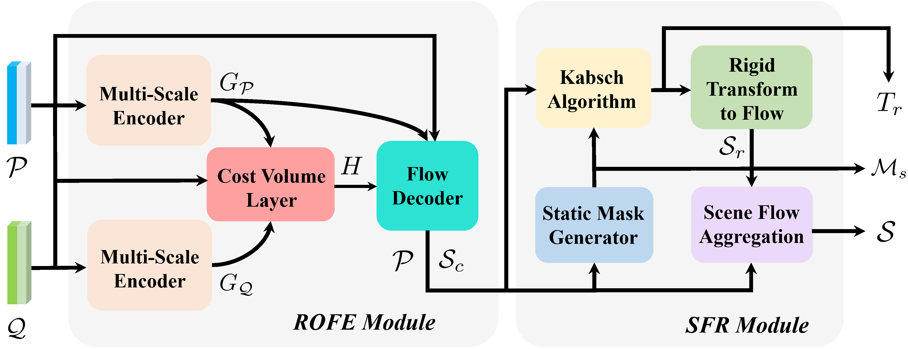
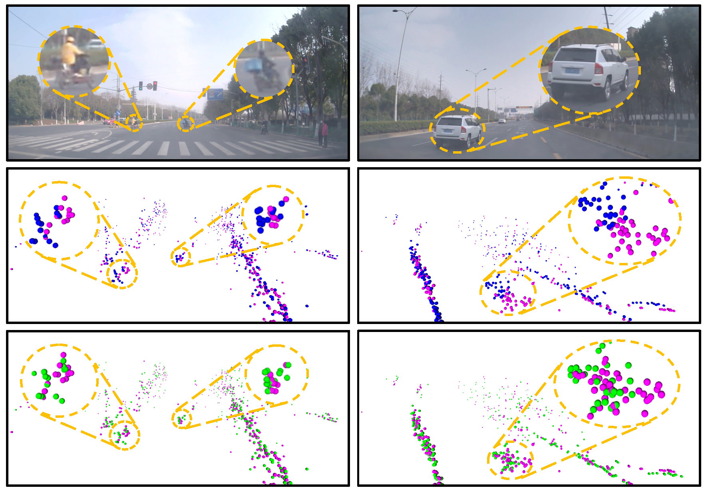
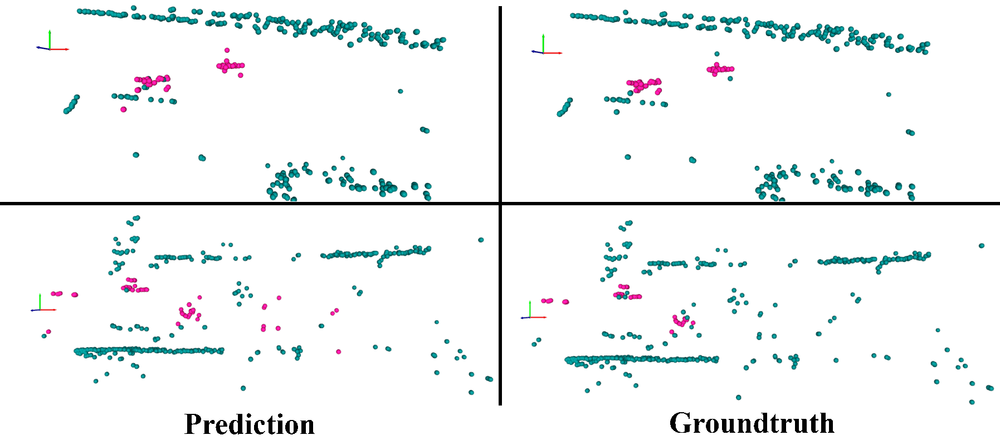

# Self-Supervised Scene Flow Estimation with 4-D Automotive Radar  

[](https://arxiv.org/abs/2203.01137)  [](https://www.youtube.com/watch?v=5_iJCZytrxo&feature=youtu.be)  [](https://github.com/Toytiny/RaFlow) 

This repository is the official implementation of RaFlow (IEEE RA-L'22), a robust method for scene flow estimation on 4-D radar point clouds with self-supervised learning. [[Paper]](https://arxiv.org/abs/2203.01137) [[Video]](https://youtu.be/5_iJCZytrxo)



## Abstract

Scene flow allows autonomous vehicles to reason about the arbitrary motion of multiple independent objects which is the key to long-term mobile autonomy. While estimating the scene flow from LiDAR has progressed recently, it remains largely unknown how to estimate the scene flow from a 4-D radar - an increasingly popular automotive sensor for its robustness against adverse weather and lighting conditions. Compared with the LiDAR point clouds, radar data are drastically sparser, noisier and in much lower resolution. Annotated datasets for radar scene flow are also in absence and costly to acquire in the real world. These factors jointly pose the radar scene flow estimation as
a challenging problem. This work aims to address the above challenges and estimate scene flow from 4-D radar point clouds by leveraging self-supervised learning. A robust scene flow estimation architecture and three novel losses are bespoken designed to cope with intractable radar data. Real-world experimental results validate that our method is able to robustly estimate the radar scene flow in the wild and effectively supports the downstream task of motion segmentation.


## Citation

If you found our work useful for your research, please consider citing:

```
@article{ding2022raflow,
  title={Self-Supervised Scene Flow Estimation with 4-D Automotive Radar},
  author={Ding, Fangqiang and Pan, Zhijun and Deng, Yimin and Deng, Yiming and Chris Xiaoxuan Lu},
  journal={IEEE Robotics and Automation Letters},
  year={2022}
}
```

## Visualization

a. Scene Flow

More qualititative results can be found in [[Results Visualization]](/doc/supply_qual.md).




b. Motion Segmentation



## Installation

> Note: the code in this repo has been tested on Ubuntu 16.04/18.04 with Python 3.7, CUDA 11.1, PyTorch 1.7. It may work for other setups, but has not been tested.

Please follow the steps below to build up your environment. Make sure that you correctly install GPU driver and CUDA before setting up.

a. Clone the repository to local

```
git clone https://github.com/Toytiny/RaFlow
```

b. Set up a new environment with Anaconda

```
conda create -n YOUR_ENV_NAME python=3.7
source activate YOUR_ENV_NAME
```

c. Install common dependicies

```
conda install pytorch==1.7.0 torchvision==0.8.0 torchaudio==0.7.0 cudatoolkit=11.0 -c pytorch
pip install -r requirements.txt
```

d. Install [PointNet++](https://github.com/sshaoshuai/Pointnet2.PyTorch) library for basic point cloud operation

```
cd lib
python setup.py install
cd ..
```

## Running

Our trained model can be found at `./checkpoints/raflow_pretrain/models`. Besides our code, we also provide a few test, training and valiation data under `./demo_data/`.

a. For evaluation on test data, please run

```
python main.py --eval --vis --dataset_path ./demo_data/ --exp_name raflow_pretrain
```

The results visualization at bird-eye view (BEV) will be saved under `./checkpoints/raflow_pretrain/test_vis_2d/`.

b. For training new model, please run

```
python main.py --dataset_path ./demo_data/ --exp_name raflow_new
```

Experiment configuration can be modified at `./configs.yaml`.

Since only limited data is provided in this repository, we recommend the users to collect their own data or use recent public datasets for large-scale training and test.


## Acknowledgments
This repository is based on the following codebases.  

* [PointPWC](https://github.com/DylanWusee/PointPWC)
* [FlowNet3D_PyTorch](https://github.com/hyangwinter/flownet3d_pytorch)

