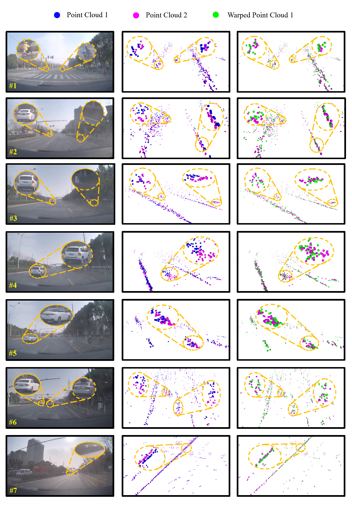

# Self-Supervised Scene Flow Estimation with 4-D Automotive Radar  

[](https://arxiv.org/abs/2203.01137)  [](https://www.youtube.com/watch?v=5_iJCZytrxo&feature=youtu.be)  [](https://github.com/Toytiny/RaFlow) 

This repository is the official implementation of [**RaFlow**](https://arxiv.org/abs/2203.01137) (IEEE RA-L'22), a robust method for scene flow estimation on 4-D radar point clouds with self-supervised learning. 


## Citation

If you found our work useful for your research, please consider citing:

```
@article{ding2022raflow,
  title={Self-Supervised Scene Flow Estimation with 4D Automotive Radar},
  author={Ding, Fangqiang and Pan, Zhijun and Deng, Yimin and Deng, Yiming and Chris Xiaoxuan Lu},
  journal={IEEE Robotics and Automation Letters},
  year={2022}
}
```

## Visulization

