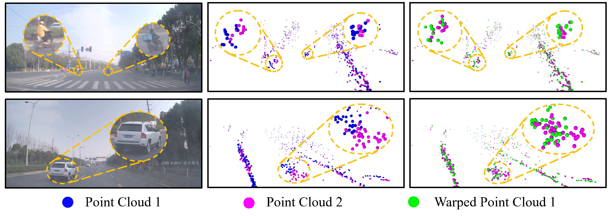

# Self-Supervised Scene Flow Estimation with 4-D Automotive Radar  

[](https://arxiv.org/abs/2203.01137)  [](https://www.youtube.com/watch?v=5_iJCZytrxo&feature=youtu.be)  [](https://github.com/Toytiny/RaFlow) 

This repository is the official implementation of [**RaFlow**](https://arxiv.org/abs/2203.01137) (IEEE RA-L'22), a robust method for scene flow estimation on 4-D radar point clouds with self-supervised learning. [[Video]](https://youtu.be/5_iJCZytrxo)


## Citation

If you found our work useful for your research, please consider citing:

```
@article{ding2022raflow,
  title={Self-Supervised Scene Flow Estimation with 4-D Automotive Radar},
  author={Ding, Fangqiang and Pan, Zhijun and Deng, Yimin and Deng, Yiming and Chris Xiaoxuan Lu},
  journal={IEEE Robotics and Automation Letters},
  year={2022}
}
```

## Visualization

More qualititative results can be found in [[Results Visualization]](/doc/supply_qual.md)



## Installation

> Note: the code in this repo has been tested on Ubuntu 18.04 with Python 3.7, CUDA 11.1, PyTorch 1.7. It may work for other setups, but has not been tested.

Please follow the steps below to build up your environment.

Clone the repository to local

```
git clone https://github.com/Toytiny/RaFlow
```

Set up a new environment with Anaconda

```
conda create -n YOUR_ENV_NAME python=3.7
source activate YOUR_ENV_NAME
```

Install common dependicies

```
conda install pytorch==1.7.0 torchvision==0.8.0 torchaudio==0.7.0 cudatoolkit=11.0 -c pytorch
pip install -r requirements.txt
```

Install [PointNet++](https://github.com/sshaoshuai/Pointnet2.PyTorch) library for basic point cloud operation

```
cd lib
python setup.py install
cd ..
```


## Acknowledgments
This repository is based on the following codebases.  

* [PointPWC](https://github.com/DylanWusee/PointPWC)
* [FlowNet3D_PyTorch](https://github.com/hyangwinter/flownet3d_pytorch)

