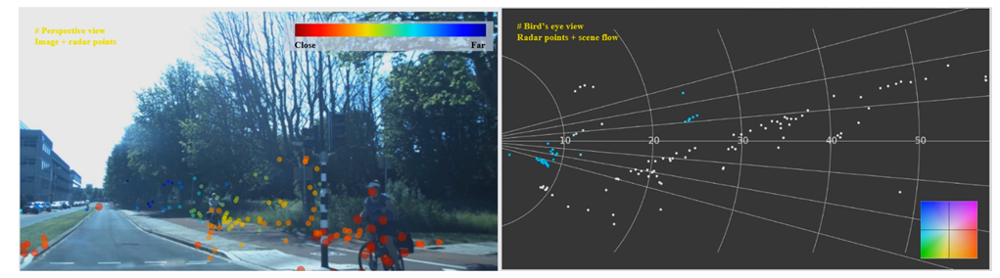

# Self-Supervised Scene Flow Estimation with 4-D Automotive Radar  

[](https://arxiv.org/abs/2203.01137)  [](https://www.youtube.com/watch?v=5_iJCZytrxo&feature=youtu.be)  [](https://toytiny.github.io/publication/22-raflow-ral/index.html)

This repository is the official implementation of RaFlow (IEEE RA-L & IROS'22), a robust method for scene flow estimation on 4-D radar point clouds with self-supervised learning. [[Paper]](https://ieeexplore.ieee.org/document/9810356) [[Video]](https://youtu.be/5_iJCZytrxo)


## News

[2022-10-08] We run our method on the publicly available [View-of-Delft (VoD)](https://github.com/tudelft-iv/view-of-delft-dataset) dataset. A video demo can be found at [Video Demo](#video-demo). Please see [Running](#running) for how to experiment with the VoD dataset.


## Abstract

Scene flow allows autonomous vehicles to reason about the arbitrary motion of multiple independent objects which is the key to long-term mobile autonomy. While estimating the scene flow from LiDAR has progressed recently, it remains largely unknown how to estimate the scene flow from a 4-D radar - an increasingly popular automotive sensor for its robustness against adverse weather and lighting conditions. Compared with the LiDAR point clouds, radar data are drastically sparser, noisier and in much lower resolution. Annotated datasets for radar scene flow are also in absence and costly to acquire in the real world. These factors jointly pose the radar scene flow estimation as
a challenging problem. This work aims to address the above challenges and estimate scene flow from 4-D radar point clouds by leveraging self-supervised learning. A robust scene flow estimation architecture and three novel losses are bespoken designed to cope with intractable radar data. Real-world experimental results validate that our method is able to robustly estimate the radar scene flow in the wild and effectively supports the downstream task of motion segmentation.


## Citation

If you found our work useful for your research, please consider citing:

```
@article{ding2022raflow,
  author={Ding, Fangqiang and Pan, Zhijun and Deng, Yimin and Deng, Jianning and Lu, Chris Xiaoxuan},
  journal={IEEE Robotics and Automation Letters}, 
  title={Self-Supervised Scene Flow Estimation With 4-D Automotive Radar}, 
  year={2022},
  pages={1-8},
  doi={10.1109/LRA.2022.3187248}}
}
```

## Video Demo

A short video demo showing our qualitative results on the View-of-Delft dataset (click the figure to see):
<div align="center">
  <a href="https://drive.google.com/file/d/1rTDdiY5hJ1FleN1K7YjnP15MpMebaShb/view?usp=sharing"></a>
</div>


## Visualization

#### a. Scene Flow

More qualititative results can be found in [Results Visualization](/doc/supply_qual.md).


#### b. Motion Segmentation


## Installation

> Note: the code in this repo has been tested on Ubuntu 16.04/18.04 with Python 3.7, CUDA 11.1, PyTorch 1.7. It may work for other setups, but has not been tested.

Please follow the steps below to build up your environment. Make sure that you correctly install GPU driver and CUDA before setting up.

#### a. Clone the repository to local

```
git clone https://github.com/Toytiny/RaFlow
```

#### b. Set up a new environment with Anaconda

```
conda create -n YOUR_ENV_NAME python=3.7
source activate YOUR_ENV_NAME
```

#### c. Install common dependicies

```
conda install pytorch==1.7.0 torchvision==0.8.0 torchaudio==0.7.0 cudatoolkit=11.0 -c pytorch
pip install -r requirements.txt
```

#### d. Install [PointNet++](https://github.com/sshaoshuai/Pointnet2.PyTorch) library for basic point cloud operation

```
cd lib
python setup.py install
cd ..
```

## Running

### a. Inhouse data 

The main experiments are conducted on our inhouse dataset. Our trained model can be found at `./checkpoints/raflow/models`. Besides, we also provide a few testing, training and valiation data under `./demo_data/` for users to run.

For evaluation on inhouse test data, please run

```
python main.py --eval --vis --dataset_path ./demo_data/ --exp_name raflow
```

The results visualization at bird's eye view (BEV) will be saved under `./checkpoints/raflow/test_vis_2d/`. Experiment configuration can be further modified at `./configs.yaml`.

For training new model, please run

```
python main.py --dataset_path ./demo_data/ --exp_name raflow_new
```

Since only limited inhouse data is provided in this repository, we recommend the users to collect their own data or use recent public datasets for large-scale training and testing.


### b. VoD data

We also run our method on the public View-of-Delft (VoD) dataset. To start, please first request the access from their [official webiste](https://github.com/tudelft-iv/view-of-delft-dataset) and download their data and annotations. Before experiments, please put your preprocessed scene flow samples under `./vod_data/` and split them into training, validation and testing sets. 

Here we provide our trained model on the VoD dataset under `./checkpoints/raflow_vod/models`. For evaluating this model on VoD, please run the following code:

```
python main.py --eval --vis --dataset_path ./vod_data/ --model raflow_vod --exp_name raflow_vod --dataset vodDataset
```

For training your own model, please run:

```
python main.py --dataset_path ./vod_data/ --model raflow_vod --exp_name raflow_vod_new --dataset vodDataset
```

We will release our code for preprocessing the VoD dataset later.

## Acknowledgments
This repository is based on the following codebases.  

* [PointPWC](https://github.com/DylanWusee/PointPWC)
* [FlowNet3D_PyTorch](https://github.com/hyangwinter/flownet3d_pytorch)
* [PointNet++_PyTorch](https://github.com/sshaoshuai/Pointnet2.PyTorch)

