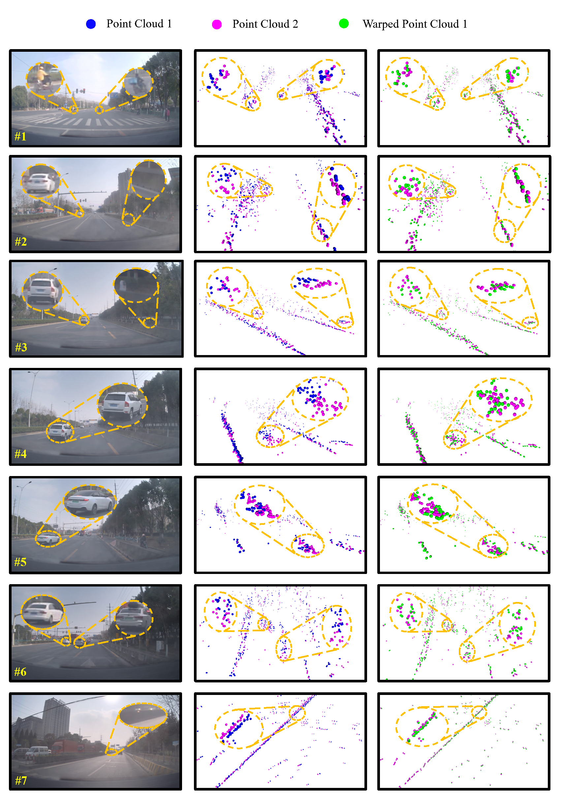

## Results Visualization

Besides the qualitative figures and demos provided in our paper and video, we show more visualized results here. Note that yellow circles denote the zooming-in operation.  Generally, the green points should be closer to the magenta points if the scene flow is accurately predicted. To help understand these examples, we list their description in the following table.

| Example            | #1                     | #2                                      | #3                               | #4             | #5             | #6             | #7                   |
| ------------------ | ---------------------- | --------------------------------------- | -------------------------------- | -------------- | -------------- | -------------- | -------------------- |
| Ego-vehicle status | Static                 | Forward                                 | Forward                          | Forward        | Forward        | Forward        | Turning right        |
| Zoom-in content    | Two moving motorcycles | One static car and static stone railing | One moving car and static plants | One moving car | One moving car | Two static car | Static stone railing |

